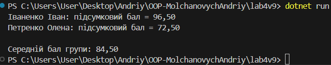

# Лабораторна робота №4 (lab4v9)

## Тема та мета роботи
**Тема:** Інтерфейси, абстрактні класи, композиція та агрегація в об’єктно-орієнтованому програмуванні (C#).

**Мета:**  
Ознайомитись із використанням інтерфейсів та абстрактних класів у мові C#.  
Навчитись реалізовувати різні типи оцінювання студентів (екзамен, проєкт) з використанням композиції та поліморфізму.

---

## Опис виконання завдання
У проєкті створено систему оцінювання студентів:

- **Інтерфейс `IGrade`** — визначає методи `GetScore()` та `GetDescription()`.
- **Абстрактний клас `Grade`** — реалізує спільні властивості для типів оцінок.
- **Класи-нащадки:**  
  - `Exam` — оцінка за екзамен.  
  - `Project` — оцінка за проєкт (з урахуванням коефіцієнта складності).
- **Клас `Student`** — зберігає список оцінок (`композиція`), дозволяє обчислити підсумковий бал.
- **Методи програми:**  
  - Розрахунок підсумкових балів студентів.  
  - Обчислення середнього балу по групі.

---

## Приклад запуску програми


---
## Висновок
У ході лабораторної роботи було створено програму, яка демонструє використання інтерфейсів, абстрактних класів, композиції та поліморфізму в C#.
Було реалізовано систему оцінювання студентів, де кожен тип оцінки (екзамен чи проєкт) має власну логіку, але дотримується єдиного контракту через інтерфейс.
Також було показано, як композиція дозволяє об’єднувати різні об’єкти в одному класі (Student) без жорсткої залежності від конкретних реалізацій.
Робота допомогла краще зрозуміти основи ООП та принципи побудови гнучких, масштабованих систем.

---

### Контрольні запитання
1. У чому різниця між абстрактним класом і інтерфейсом?

Інтерфейс визначає лише контракт (методи/властивості без реалізації).

Абстрактний клас може містити як абстрактні методи, так і реалізовані.

Клас може реалізовувати кілька інтерфейсів, але наслідувати лише один абстрактний клас.

Абстрактний клас часто використовується для спільної логіки, а інтерфейс — для опису поведінки.

2. Коли краще використовувати композицію, а коли наслідування?

Наслідування — коли новий клас є "спеціалізованою версією" базового класу (відносини типу is-a).
- Наприклад: Project → Grade.

Композиція — коли один клас "складається" з інших об’єктів (відносини has-a).
- Наприклад: Student має список оцінок (List<IGrade>).

Композиція вважається більш гнучкою, оскільки дозволяє змінювати поведінку без глибокої ієрархії спадкування.

3. Як працює агрегація та чим вона відрізняється від композиції?

Композиція — коли об’єкт "володіє" іншими об’єктами, і вони знищуються разом із ним.
- Наприклад: Student містить оцінки, і при видаленні студента оцінки теж зникають.

Агрегація — слабший зв’язок: об’єкт може існувати незалежно від власника.
- Наприклад: одна оцінка може належати кільком звітам або статистиці, не будучи знищеною.

4. Чи може клас реалізовувати кілька інтерфейсів одночасно?

Так.
У C# клас може реалізовувати будь-яку кількість інтерфейсів, наприклад:
```csharp
class Example : IReadable, IWritable, IDisposable { ... }
```
Це дозволяє комбінувати поведінку з різних джерел без множинного спадкування.

5. Для чого в ООП використовують інтерфейси як контракти?

Інтерфейси використовуються як контракти для визначення того, що клас має робити, не вказуючи, як саме.
Це дозволяє:

забезпечити єдину структуру для різних реалізацій;

спростити тестування (можна замінювати класи з тим самим інтерфейсом);

підвищити гнучкість і масштабованість системи.